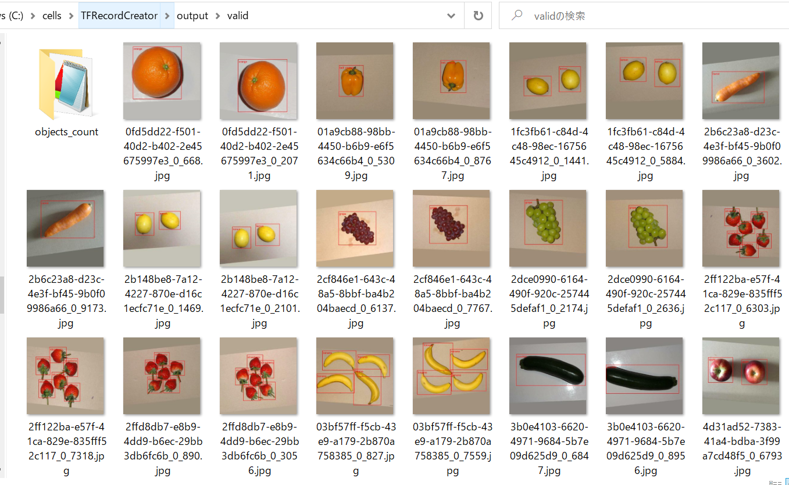

# TFRecordCreator
TFRecordCreator from other annotations 

<a href="./YOLO2TFRecordCreator.py">YOLO2TFRecordCreator</a> is a simple TFRecordCreator from YOLO annotations. 

Please run the following command on a command line prompt window. 

<pre>
>python YOLO2TFRecordCreator.py inpput_images_dir input_yolo_anno_dir output_tfrecor_dir dataset_name
</pre>
For example, run the command. 
<pre>
>python YOLO2TFRecordCreator.py ./YOLO/valid ./YOLO/valid ./tfrecord valid
</pre>
A <b>valid.tfrecord</b> file will be created in <b>./tfrecord</b> folder. 
 

If you would like to inspect the created tfrecord file, please run the following command. 
<pre>
>python TFRecordInspector.py ./tfrecord/valid/valid.tfrecord ./label_map.pbtxt ./output/valid
</pre>

The following is the annotated images generated by the above command. 
 

